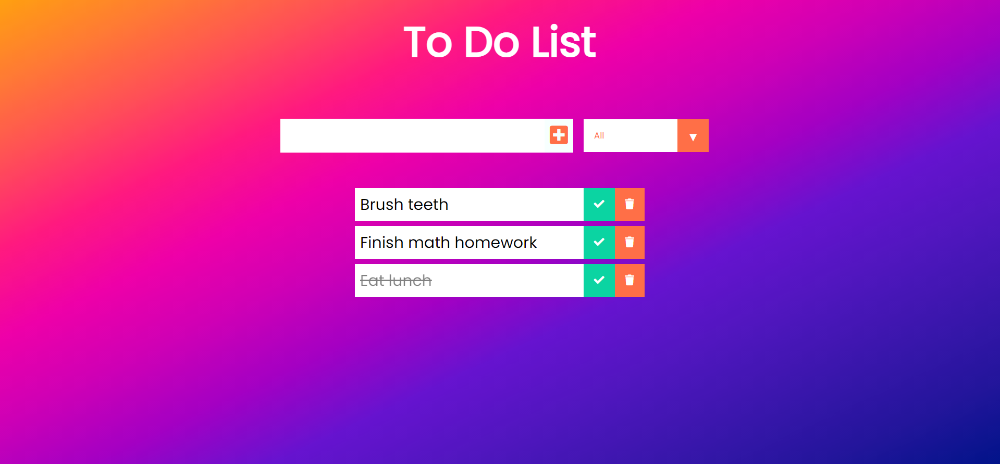

# Details
This is a simple to do list project which I started working on to familiarize myself with web development using React. It is fully functional as of now, but I am working on making it into a mobile app as the next goal.

## Helpful Resources
DevEd (YouTube Channel)
https://www.youtube.com/channel/UClb90NQQcskPUGDIXsQEz5Q

## Getting Started with Create React App

This project was bootstrapped with [Create React App](https://github.com/facebook/create-react-app).

### `npm start`

Runs the app in the development mode.\
Open [http://localhost:3000](http://localhost:3000) to view it in the browser.

The page will reload if you make edits.\
You will also see any lint errors in the console.
